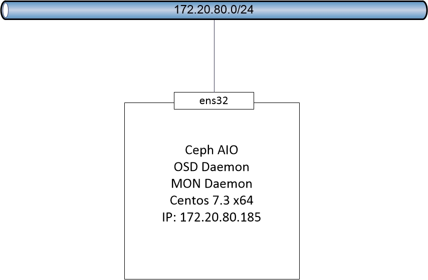

# Hướng dẫn cài đặt CEPH sử dụng `ceph-deploy` trên 1 máy duy nhất (CEPH AIO)

## 1. Mục tiêu LAB
- Mô hình này sẽ cài tất cả các thành phần của CEPH lên một máy duy nhất, bao gồm:
  - Ceph-deploy
  - Ceph-admin
  - Mon
  - OSD


## 2. Mô hình 
- Sử dụng mô hình dưới để cài đặt CEPH AIO chỉ cần một máy chủ để cài đặt CEPH. 


## 3. Chuẩn bị môi trường
- OS
  - CentOS Server 7.3 64 bit
  - 04: HDD, trong đó:
    - `sda`: sử dụng để cài OS
    - `sdb, sdc, sdd`: Dung lượng 50GB , sử dụng làm OSD (nơi chứa dữ liệu của client)
  - 01 NIC: 
    - `ens32`: dải cấp phát cho client (các máy trong OpenStack) sử dụng, thuộc dải 172.20.80.0/24  
- CEPH Version Jewel

## 4. Cài đặt môi trường cơ bản
- Lưu ý :
  - Tất cả câu lệnh đều thực hiện với quyền `ROOT`  

- Bước 1: Đặt hostname và file hosts
  ```sh
  hostnamectl set-hostname ceph 
  echo "172.20.80.185 ceph" >> /etc/hosts
  ```
- Bước 2: Thiết lập IP cho máy CEPH
  ```sh
  nmcli c modify ens32 ipv4.addresses 172.20.80.185/24
  nmcli c modify ens32 ipv4.method manual
  nmcli c modify ens32 ipv4.gateway 172.20.80.250
  nmcli c modify ens32 connection.autoconnect yes
  ```
  
- Bước 3: Cấu hình các thành phần mạng cơ bản
  ```sh
  sudo systemctl disable firewalld
  sudo systemctl stop firewalld
  sudo systemctl disable NetworkManager
  sudo systemctl stop NetworkManager
  sudo systemctl enable network
  sudo systemctl start network
  ```

- Bước 4: Vô hiệu hóa Selinux
  ```sh
  sed -i 's/SELINUX=enforcing/SELINUX=disabled/g' /etc/selinux/config
  ```
- Bước 5: Format các phân vùng làm OSD với định dạng XFS
  ```sh
  sudo parted -s /dev/sdb mklabel gpt mkpart primary xfs 0% 100%
  sudo parted -s /dev/sdc mklabel gpt mkpart primary xfs 0% 100%
  sudo parted -s /dev/sdd mklabel gpt mkpart primary xfs 0% 100%
  sudo mkfs.xfs /dev/sdb -f
  sudo mkfs.xfs /dev/sdb -f
  sudo mkfs.xfs /dev/sdb -f
  ```
- Bước 6: Khởi động lại máy chủ sau khi cấu hình cơ bản.
  ```sh
  reboot
  ```
## 6. Cài đặt Ceph Deploy và deploy Ceph AIO
- Đăng nhập lại bằng quyền `root` sau khi máy chủ reboot xong.

- Bước 1: Cài đặt Ceph Deploy
  ```sh
  rpm -Uhv http://download.ceph.com/rpm-jewel/el7/noarch/ceph-release-1-1.el7.noarch.rpm
  sudo yum update -y && sudo yum install ceph-deploy -y
  ```
- Bước 2: Tạo thư mục ceph (mục đích để chứa file config sinh ra từ ceph deploy)
  ```sh
mkdir ceph
cd ceph
  ```
- Bước 3: Tạo một cluster config file và xác định monitor node chạy cùng trên Ceph AIO node
  ```sh
ceph-deploy new ceph
  ```
- Bước 4: Thêm các dòng dưới vào file `ceph.conf` vừa được tạo ra ở trên
  ```sh
  echo "osd pool default size = 2" >> ceph.conf
  echo "osd crush chooseleaf type = 0" >> ceph.conf
  echo "osd journal size = 1000" >> ceph.conf
  ```
- Bước 5:  Cài đặt phần mềm Ceph
  ```sh
ceph-deploy install ceph
  ```
- Bước 6: Deploy Ceph Monitor 
  ```sh
ceph-deploy mon create-initial
  ```
- Bước 7: Tạo một monitor key
  ```sh
ceph-deploy gatherkeys ceph
  ```
- Bước 8: Kiểm tra tính sẵn sàng của các phân vùng làm OSD (Trả về là XFS là chuẩn)
  ```sh
ceph-deploy disk list ceph
  ```
- Bước 9: Xóa toàn bộ nội dung của các phân vùng làm OSD
  ```sh
ceph-deploy disk zap ceph:/dev/sdb ceph:/dev/sdc ceph:/dev/sdd
  ```
- Bước 10: Prepare các phân vùng, đảm bảo không có thông báo ERROR, bước này cũng chia phân vùng data + journal
  ```sh
  ceph-deploy osd prepare ceph:/dev/sdb ceph:/dev/sdc ceph:/dev/sdd
  ```
- Bước 11: Thực hiện Active các phân vùng
  ```sh
  ceph-deploy osd activate ceph:/dev/sdb ceph:/dev/sdc ceph:/dev/sdd
  ```
- Bước 12: Đẩy key xuống client (Đẩy vào thư mục /etc/ceph)
  ```sh
  ceph-deploy admin ceph
  ```
- Bước 13: Phân quyền lại file key
  ```sh
  chmod 644 /etc/ceph/ceph.client.admin.keyring
  ```
- Bước 14: Kiểm tra lại trạng thái hệ thống bằng lệnh `ceph -s`, nếu trả về OK là thành công
  ```sh
    cluster e7c21eef-3254-4ae5-9107-817caa220a10
     health HEALTH_OK
     monmap e1: 1 mons at {ceph=10.10.10.185:6789/0}
            election epoch 4, quorum 0 ceph
     osdmap e66: 3 osds: 3 up, 3 in
            flags sortbitwise,require_jewel_osds
      pgmap v11611: 448 pgs, 4 pools, 131 MB data, 46 objects
            372 MB used, 146 GB / 146 GB avail
                 448 active+clean
   ```
- Bước 13: Kiểm tra cấu hình các OSD bằng lệnh `sudo lsblk`, nếu thành công, kết quả như sau
```sh
NAME        MAJ:MIN RM  SIZE RO TYPE MOUNTPOINT
fd0           2:0    1    4K  0 disk 
sda           8:0    0   20G  0 disk 
├─sda1        8:1    0    1G  0 part /boot
└─sda2        8:2    0   19G  0 part 
  ├─cl-root 253:0    0   17G  0 lvm  /
  └─cl-swap 253:1    0    2G  0 lvm  [SWAP]
sdb           8:16   0   50G  0 disk 
├─sdb1        8:17   0   49G  0 part /var/lib/ceph/osd/ceph-0
└─sdb2        8:18   0    1G  0 part 
sdc           8:32   0   50G  0 disk 
├─sdc1        8:33   0   49G  0 part /var/lib/ceph/osd/ceph-1
└─sdc2        8:34   0    1G  0 part 
sdd           8:48   0   50G  0 disk 
├─sdd1        8:49   0   49G  0 part /var/lib/ceph/osd/ceph-2
└─sdd2        8:50   0    1G  0 part 
sr0          11:0    1  680M  0 rom  
```
